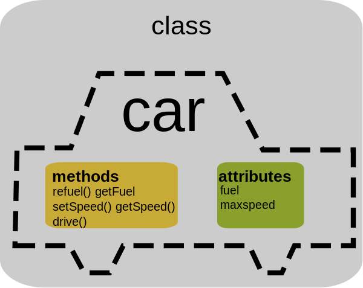
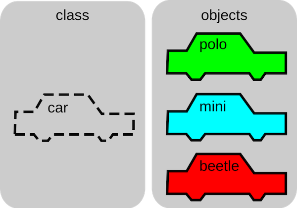

# Lesson 3

## Content
- Classes in Kotlin
  - Normal class
  - Data class
- Abstract class
- Interface

## Useful links
- [Slack channel](https://appport-academy.slack.com/) (invite can be requested via [event link](https://appport.cz/event/appport-academy/) or [Meetup group](https://www.meetup.com/Prague-Mobile-Development-Meetup/events/269765161/))
- [Github](https://github.com/Concur-Kotlin-Academy/academy2020)
- Kotlin manual: [link](https://kotlinlang.org/docs/reference/classes.html)

## A little bit of theory
### Object Oriented Programming (OOP)
> Object oriented programming allows us to solve complex problems by using objects

More info in [Wikipedia](https://en.wikipedia.org/wiki/Object-oriented_programming)


### Classes
#### What's a class?
**CLASS** is a blueprint or a set of instructions to build a specific type of object.



##### Parts of a class
1. **Name:** Identifies the class
2. **Constructor(s):** Function used to initialize the state/properties of newly created objects of the class. Invoked when creating an instance of the class
3. **Attribute(s)/property(ies):** keep state
4. **Method(s)/function(s):** Do something

##### Visibility modifiers in Kotlin
Classes, objects, interfaces, constructors, functions, properties and their setters can have visibility modifiers.

- `private` - visible (can be accessed) from inside the class only.
- `protected` - visible to the class and its subclass.
- `internal` - any client inside the module can access them.
- `public` - visible everywhere.

> The default visibility, used if there is no explicit modifier, is **public**.


#### What are objects?
**OBJECT** is an instance of a class. An object is nothing but a self-contained component which consists of methods and properties to make a particular type of data useful



#### What's the difference between class and object?
- A class is a blueprint or prototype that defines the variables and the methods (functions) common to all objects of a certain kind.
- An object is a specimen of a class. Software objects are often used to model real-world objects you find in everyday life.

## Tasks
### Project creation
1. Open IntelliJ IDEA
2. Select create new project
3. Choose `Gradle -> Kotlin/JVM`
4. Name the project `lesson-03`
5. Create a new Kotlin file in the `src` folder with name `Main`
6. Add the following Kotlin code

    ```kotlin
    fun main(){
        println("Hello World")
    }
    ```
7. Right click -> run `MainKt` and check that it works


### Working with classes
#### Task 1
1. Convert the previous `Hello world` implementation to an Objected-oriented version

#### Task 2
1. Define the class `Car` according to the image above
 
    - Add also 2 new properties: `name` and `maxFuel`
    - `name`, `maxFuel` and `maxSpeed` are constructor parameters
    - Add also a function called `stop()`
2. The `drive()` function will go from 0 to `maxSpeed` and when reached, it will call the `stop()` function
3. The `stop()` function will go from `maxSpeed` to 0 and when reached it will print a message
4. In the `main()` function, create 2 instances of the class `Car` and let them race against each other

### Working with data classes
**When to use them?** When you want to let the compiler know that you are creating this class for holding data

> When defining a data class, there are several functions automatically generated for you:
> 
> - equals()
> - hashCode()
> - toString()
> - copy()
> - componentN()

#### Task
1. Define the class `CarData` according to the image above

    - Add also 2 new properties: `name` and `maxFuel`
    - `name`, `maxFuel` and `maxSpeed` are constructor parameters

### Interfaces
An interface generally defines the set of methods/functions along with their arguments and applicable return types that an instance of a class that has that interface could respond to. How those set of operations are implemented, is left to that particular class. 


#### Task

1. Create an interface called `CarInterface` for our `Car` class

### Abstract classes
Abstract classes are classes that contain one or more abstract methods. An abstract method is a method that is declared, but contains no implementation. Abstract classes may not be instantiated (you cannot create objects of an abstract class), and require subclasses to provide implementations for the abstract methods.

#### Task
1. Create an abstract class called `CarAbstract` for our `Car` class

### What's the difference?
- Interfaces can have functions with default bodies. Those functions **cannot be final and they can always be overriden**
- Interfaces **cannot have state** (theorically)
- Abstract classes can have everything interfaces have, but also **they can have fields and constructors** (allowing to hold state properly)
- **Functions and properties with default bodies** in abstract classes **can be final** and they are final by default

### Extra (in case we have time, or to do at home)
First contact with coroutines, although we will learn them in detail in **lesson 7**:

- Add the following line to the dependencies section of the `build.gradle` file:

        implementation "org.jetbrains.kotlinx:kotlinx-coroutines-core:1.3.4"
- Wrap the `drive()` function of each car with `GlobalScope.launch { ... }`
- Run both cars 


## Additional sources
- Interactive playground [link](https://play.kotlinlang.org/koans/Introduction/Hello,%20world!/Task.kt)
- Kotlin classes and objects [link](https://www.programiz.com/kotlin-programming/class-objects)
