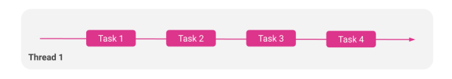
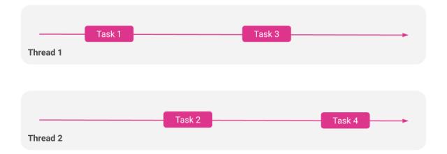
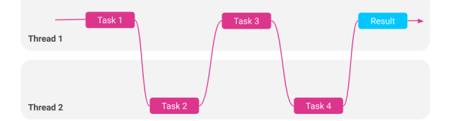
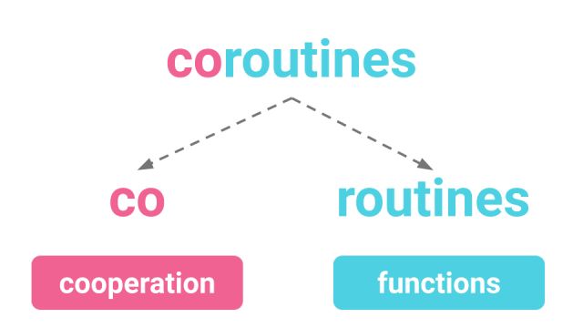
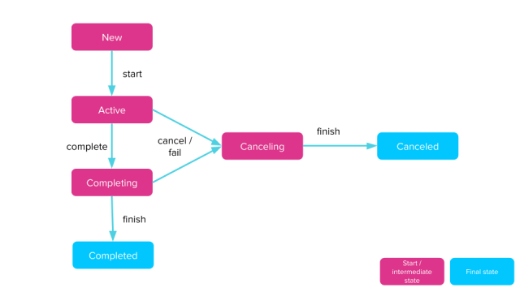

# Lesson 6

## Content
- Coroutines
 - Scopes
 - Builders
     - launch()
     - runBlocking()
     - suspend functions
     - async / await

## Useful links
- [Slack channel](https://appport-academy.slack.com/) (invite can be requested via [event link](https://appport.cz/event/appport-academy/) or [Meetup group](https://www.meetup.com/Prague-Mobile-Development-Meetup/events/269765161/))
- [Github](https://github.com/Concur-Kotlin-Academy/academy2020)
- Kotlin manual: [link](https://kotlinlang.org/docs/reference/coroutines/coroutines-guide.html)
- Kotlin coroutines: [link](https://github.com/Kotlin/kotlinx.coroutines)

## A little bit of theory
### Different ways of executing your code
#### Sequencial execution


#### Parallel execution


#### Concurrent execution


### What are coroutines?


### Coroutine scopes
A coroutine should run in a scope. The scope is used in order to track the lifecycle of the coroutine. Also it is a way to bind the coroutine(s) to an app specific lifecycle.

Structured concurrency is related to three main things:

- Keep track of the running coroutine
- Cancel work when it is not longer necessary to run it
- Notify errors when something bad happens to a coroutine

### Coroutine builders
#### runBlocking()
- Runs a new coroutine
- Blocks current thread interruptible until its completion
- Could set a name to the coroutine for debug purposes

#### launch()
- Extension function of CoroutineScope
- Launches a new coroutine
- Does not block the current thread
- Returns a reference to the coroutine as a Job. Job's lifecycle:

    

#### suspend functions
- Suspend the execution of the current task and let another task execute
- Could be called only from within a coroutine
- There are 2 functions that could help us to achieve this behavior:
 - delay() => pause the currently executing task for a specific time (milliseconds)
 - yield() => let other task to be executed

#### async / await
- async() is an extension function of CoroutineScope
- If we want to execute a task asynchronously and get the result, we should use async() instead of launch() function.
- async() creates a new coroutine and returns its future result as an implementation of Deferred<T> which has an await() function very helpful in order to get the status of the coroutine.
- The call to await() will wait for the coroutine started by async() to complete.

## Tasks
### Project creation
1. Open IntelliJ IDEA
2. Select create new project
3. Choose `Gradle -> Kotlin/JVM`
4. Name the project `lesson-06`
5. Add the following line to the dependencies section of the `build.gradle` file:

        implementation "org.jetbrains.kotlinx:kotlinx-coroutines-core:1.3.7"
6. Create a new Kotlin file in the `src` folder with name `Main`
7. Add the following Kotlin code

    ```kotlin
    fun main() {
        println("Start")
        println("End")
    }
    ```
8. Right click -> run `MainKt` and check that it works


### Playing with sequencial execution
- Create 2 functions called task1() and task2()
 - Task1 will go from 1 to 200 with a delay of 10ms between iterations
 - Task2 will go from 1 to 100 with a delay of 10ms between iterations
 - Each task will print a message when finished
- Run both tasks in `main()` between `Start` and `End`

### Our first coroutine: Playing with launch
- Wrap each call to the task functions with `launch { }`
- Wrap each call to the task functions with `GlobalScope.launch { }`

### Playing with runBlocking
- Wrap the call to the functions created before with `runBlocking { }`

### Playing with suspended functions
- Add the modifier `suspend` to each task function
- Add `delay` to our task functions
- Using `yield`

### Playing with async
- Change the return type of `task1()` to String and return the finishing message when the function finishes
- Wrap `task1()` with async

