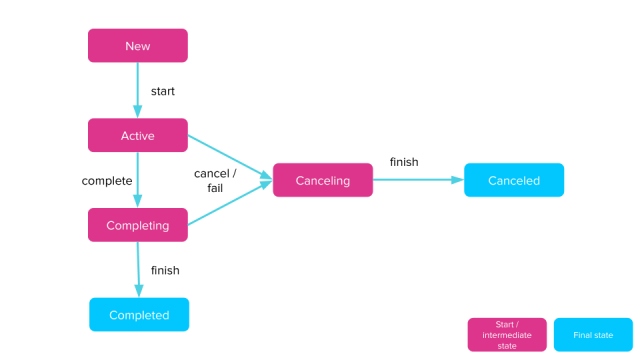

# Lesson 7

## Content
- Coroutines
 - ~~Scopes~~
 - ~~Builders~~
     - ~~launch()~~
     - ~~runBlocking()~~
     - ~~suspend functions~~
     - ~~async / await~~
 - Contexts
 - Changing context
 - Cancelling coroutines

## Useful links
- [Slack channel](https://appport-academy.slack.com/) (invite can be requested via [event link](https://appport.cz/event/appport-academy/) or [Meetup group](https://www.meetup.com/Prague-Mobile-Development-Meetup/events/269765161/))
- [Github](https://github.com/Concur-Kotlin-Academy/academy2020)
- Kotlin manual: [link](https://kotlinlang.org/docs/reference/coroutines/coroutine-context-and-dispatchers.html)
- Kotlin coroutines: [link](https://github.com/Kotlin/kotlinx.coroutines)

## A little bit of theory
### Context
Coroutines always execute in some context that is a set of various elements.

The main elements are:

- Job: models a cancellable workflow with multiple states and a life-cycle that culminates in its completion
- Dispatcher: determines what thread or threads the corresponding coroutine uses for its execution. With the dispatcher, we can confine a coroutine execution to a specific thread, dispatch it to a thread pool, or let it run unconfined

### Dispatchers
- `Dispatchers.Default`: Different thread (if possible). It is backed by a shared pool of threads on JVM => CPU
- `Dispatchers.Main`: Platform specific main thread (if exists) => UI/Non-blocking
- `Dispatchers.IO`: Thread designed for offloading blocking IO tasks to a shared pool of threads => Network and disk
- `Dispatchers.Unconfined`: Always uses the first available thread (most performant dispatcher).

### Change the coroutine context
> If we want to run a coroutine in one context and then change the context midway the solution is to use the `withContext()` function

- withContext:
  - Used to get a result from another thread
  - Doesn't block the thread where it is called
  - Runs in sequence
- launch / async no result:
  - Used when don't need result
  - Doesn't block the thread where it is called
  - Runs in parallel
  - `launch` re-throws exceptions, `async` holds exception until `await()` is called
- async for result:
  - When we need to wait the result and can run in parallel for efficiency
  - Blocks the thread where it is called
  - Runs in parallel

### Cancelling coroutines


#### cancel()
Cancels the Job

#### join()
Suspends the coroutine until the current job is complete

#### cancelAndJoin()
Cancels the job and suspends the invoking coroutine until the cancelled job is complete.

#### withTimeout()
- Helpful to use when a job might be taking too long to complete
- The function runs a suspending block of code inside a coroutine and throws a TimeoutCancellationException if the timeout is exceeded

#### withTimeoutOrNull()
Runs a given suspending block of code inside a coroutine with a specified timeout and returns null if this timeout was exceeded.

## Tasks
### Project creation
1. Open IntelliJ IDEA
2. Select create new project
3. Choose `Gradle -> Kotlin/JVM`
4. Name the project `lesson-07`
5. Add the following line to the dependencies section of the `build.gradle` file:

        implementation "org.jetbrains.kotlinx:kotlinx-coroutines-core:1.3.7"
6. Create a new Kotlin file in the `src` folder with name `Main`
7. Add the following Kotlin code

    ```kotlin
    fun main() {
        runBlocking {
            val resultOne = "Result1"
            val resultTwo = "Result2"
            
            println("Starting in Thread ${Thread.currentThread().name}")
            println("RESULTS: $resultOne $resultTwo")
            println("Ending in Thread ${Thread.currentThread().name}")
        }
    }
    ```
8. Right click -> run `MainKt` and check that it works

### Suspend functions
- Create 2 suspend functions:
  - `function1(): String` has a delay of 1000ms
  - `function2(): String` has a delay of 100ms
  - Each function prints and returns the string `function1`/`function2`

### Playing with context
#### `withContext(...)`
- In the `main()` function, run the previous functions in the `Dispatchers.IO context

#### `launch(...)`
- Replace the previous `withContext(...)` with `launch(...)`

#### `async(...)`
- Replace the previous `launch(...)` with `async(...)`

### Playing with coroutine jobs
#### `cancel()` and `join()`
1. Launch a new job (the context doesn't matter), which repeats 300 times, prints `Job is waiting...` and has a delay of 50ms
2. Cancel the job after waiting 2000ms

#### `withTimeout(...)` and `withTimeoutOrNull(...)`
1. Replace the previous `launch` with `withTimeout` and set the timeout to 2000ms
2. Replace `withTimeout` with `withTimeoutOrNull`
