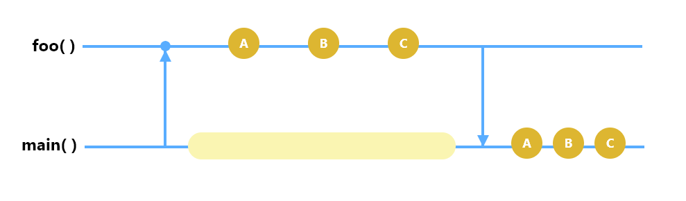
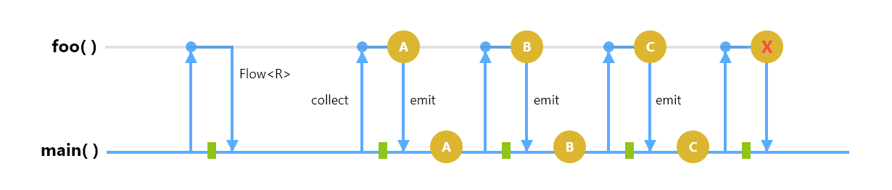

# Lesson 8

## Content
- Coroutines
 - ~~Scopes~~
 - ~~Builders~~
     - ~~launch()~~
     - ~~runBlocking()~~
     - ~~suspend functions~~
     - ~~async / await~~
 - ~~Contexts~~
 - ~~Changing context~~
 - ~~Cancelling coroutines~~
 - Flows
    - Cold flows
    - Flow Cancellation
    - Flow Builders
    - Intermediate flow operators


## Useful links
- [Slack channel](https://appport-academy.slack.com/) (invite can be requested via [event link](https://appport.cz/event/appport-academy/) or [Meetup group](https://www.meetup.com/Prague-Mobile-Development-Meetup/events/269765161/))
- [Github](https://github.com/Concur-Kotlin-Academy/academy2020)
- Kotlin manual: [link](https://kotlinlang.org/docs/reference/coroutines/flow.html#flows)
- Kotlin coroutines: [link](https://github.com/Kotlin/kotlinx.coroutines)

## A little bit of theory
### Flows
Suspending functions asynchronously returns a single value, but how can we return multiple asynchronously computed values? This is where Kotlin Flows come in.

Lets show the difference
- Suspending functions
- Flows





### Flow Cancellation
- withTimeout
- withTimeoutOrNull

### Flow Builders
- flow{}
- flowOf()
- asFlow()

### Intermediate flow operators
- map
- filter
- transform

## Tasks
### Project creation
1. Open IntelliJ IDEA
2. Select create new project
3. Choose `Gradle -> Kotlin/JVM`
4. Name the project `lesson-08`
5. Add the following line to the dependencies section of the `build.gradle` file:

        implementation "org.jetbrains.kotlinx:kotlinx-coroutines-core:1.3.7"
6. Create a new Kotlin file in the `src` folder with name `Main`
7. Add the following Kotlin code

    ```kotlin
    fun main() {
        println("Start")
        println("End")
    }
    ```
8. Right click -> run `MainKt` and check that it works

### Suspend functions
- Create 2 suspend functions:
  - `task1(): String` has a delay of 2000ms
  - `task2(): String` has a delay of 1000ms
  - Each function prints and returns the string `task1 finished`/`task2 finished`

### Suspend functions returning list of Strings
- Create a function which is calling both tasks and returning list of asynchronously computed values returned by the tasks
  - try with async
  - try with launch

#### Playing with Flows solution
- Create a function which is returning a Flow of Strings
  - Write a short for loop with delay of 1000ms in each step which emits number of each step
  - call this function in main and print collected values
- Prove that function is not blocking other execution
  - launch new coroutine in main function with the same for loop but different message

#### Cold Flows
- build the flow and store it in variable
- Collect our flow function two times

#### Task Cancellation
- Cancel one of the flows started above in the half

#### Play with flow Builders
- Create function which returns a flow created from set of fixed values of 1,2,3 and in each step it will delay for 100ms
- Create same function in which the flow will be created from the collection of values 1,2,3

#### Play with Intermediate flow operators
- Create a flow from list of values 1,2,3
  - Call one of our suspend functions in each step and print its result
- Create a flow from list of values 1,2,3
  - delay in each step for 100ms and filter flow so it collects just odd numbers
- Create a flow from list of values 1,2,3
  - transform the flow so in each step it emits related value in list a some custom message
